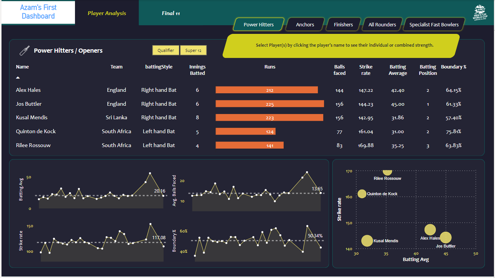

# End To End Cricket Data Analytics Project

A complete data analytics project in which I used data analysis techniques to form the best cricket team of 11 players based on the statistics of the players available at the following site: https://www.espncricinfo.com/

- For data scraping I used Python's Beautiful Soup package.
- For data preprocessing of the scraped data I used Python's Pandas package.
- For data transformation I used Microsoft's Power Query for data transformation.
- For data visualization I used Microsoft's Power Bi.

## Screenshots

# Problem Statement

## Form the best cricket team of 11 players considering the following constraints:
- The team should be able to score at least 180 runs on an average.
- The team should be able to defend 150 runs on an average.

### Openers Selection Criteria:
- Batting average > 30
- Strike rate > 140
- Innings batted > 3
- Boudnary percentage > 50
- Batting position < 4

### Middle Order Selection Criteria:
- Batting average > 40
- Strike rate > 125
- Innings batted > 3
- Average balls faced > 20
- Batting position > 2

### Lower Order Selection Criteria:
- Batting average > 25
- Strike rate > 130
- Innings batted > 3
- Average balls faced > 12
- Batting position > 4
- Innings bowled > 1

### All-Rounders Selection Criteria:
- Batting average > 15
- Strike rate > 140
- Innings batted > 2
- Batting position > 4
- Innings bowled > 2
- Bowling economy < 7
- Bowling strike rate < 20

### Specialist fast bowlers Selection Criteria:
- Innings bowled > 4
- Bowling economy < 7
- Bowling strike rate < 16
- Bowling style = "%Fast%"
- Bowling average < 20
- Dot balls percentage > 40
